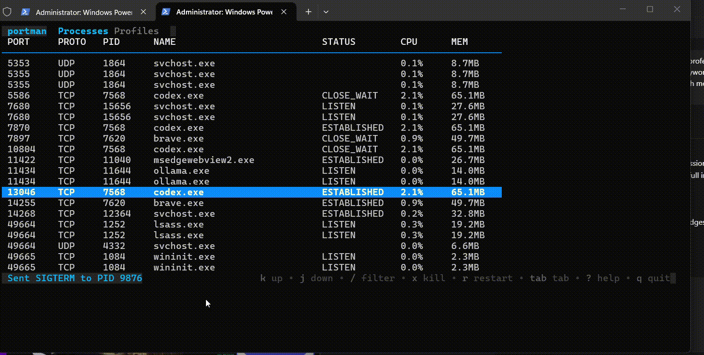

# portman — terminal port & process manager (TUI)

Local ports, processes, and profiles — all in one fast TUI.


portman is a terminal-native process and port manager for developers who live in the CLI. It gives you instant visibility into what is running, which ports are bound, and how much CPU/memory each process uses — then lets you act on it with a single keystroke. Built for speed, clarity, and daily use.




## Table of Contents

- Why portman
- Features
- Install
- Usage
- Profiles
- FAQ
- Roadmap
- Contributing
- License

## Keywords

terminal process manager, port manager, TUI, CLI tool, developer productivity, kill process, restart process, local dev stack, port scanner, process monitor, Go TUI, Bubbletea, Lipgloss, gopsutil

## Why portman

- **Real-time port visibility**: See every listening service with its PID, status, and resource usage.
- **Action-first TUI**: Kill, restart, and inspect without leaving the terminal.
- **Profiles for dev stacks**: Launch and manage groups of services together.
- **Cross-platform**: macOS, Linux, and Windows via WSL.
- **Open-source and fast**: Single Go binary, low overhead, no telemetry.

## Features

- Process & port scanner (TCP/UDP)
- Interactive TUI dashboard with keyboard navigation
- Instant kill and restart with confirmation
- Name/port filtering
- Profile creation and launcher
- Detail panel with command line and metadata
- Smooth, low-latency refresh loop

## Install

### macOS / Linux (Homebrew)

```bash
brew install ritiksuman07/tap/portman
```

### Go install

```bash
go install github.com/ritiksuman07/portman@latest
```

### From source

```bash
git clone git@github.com:Ritiksuman07/Portman.git
cd Portman

go build ./...
./portman
```

## Usage

```bash
portman
```

```bash
portman run --refresh 2
```

### Keybindings

- `j` / `k` or arrow keys: move
- `g` / `G`: jump to top / bottom
- `/`: filter by name or port
- `x`: kill process (confirm)
- `r`: restart process (confirm)
- `d`: toggle detail panel
- `tab`: switch Processes / Profiles
- `n`: new profile (Profiles tab)
- `enter`: launch profile (Profiles tab)
- `?`: help
- `q`: quit

## Profiles

Profiles are stored at:

```
~/.config/portman/profiles.json
```

Example:

```json
[
  {
    "name": "backend-stack",
    "description": "Full local dev stack",
    "commands": [
      {
        "label": "API Server",
        "cmd": "go run ./cmd/api",
        "port": 8080,
        "dir": "~/projects/myapp"
      },
      {
        "label": "PostgreSQL",
        "cmd": "docker start my-postgres",
        "port": 5432
      }
    ]
  }
]
```

## FAQ

### Why not just use `lsof`, `ss`, or `netstat`?
portman replaces scattered commands with a single, fast, interactive view. You get both visibility and action without switching contexts.

### Does portman require sudo?
No. It works for typical user processes without elevated privileges.

### Does it support Windows?
Yes ? Windows via WSL2 is supported. Native Windows support is planned for a future release.

### Is there any telemetry?
No. portman does not collect or send any analytics.

### Can I save my dev stack?
Yes. Use **Profiles** to group commands and launch them together.

## Roadmap

- Config file support
- Non-TUI CLI commands (list/kill)
- Shell completion
- Native Windows build
- Profile import/export UX

## Contributing

Issues, feature requests, and PRs are welcome. Please open an issue with details or propose a change and we will review quickly.

## License

MIT
