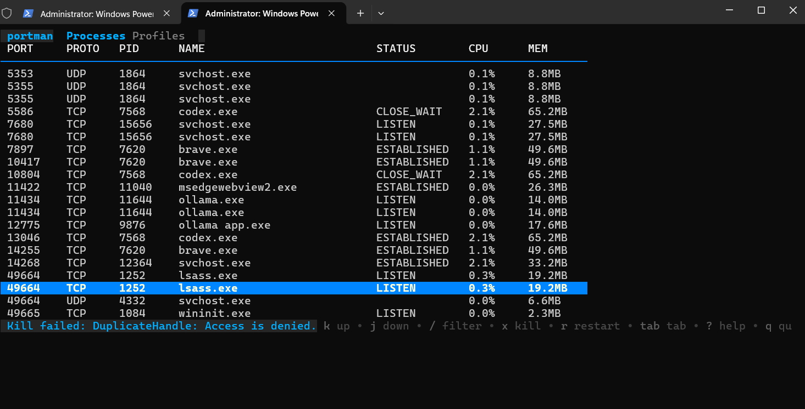

  <h1>portman</h1>
  
Local ports, processes, and profiles ? all in one fast TUI. See what is running, which ports are bound, and act instantly.

  

    
Go 1.22+

    
macOS ? Linux ? WSL

    
MIT License

  

  

<section>
  <h2>Install</h2>
  <pre><code>go install github.com/ritiksuman07/portman@latest</code></pre>
</section>

<section>
  <h2>Quick Start</h2>
  <pre><code>portman</code></pre>
</section>

<section>
  <h2>Docs</h2>
  <ul>
    <li><a href="getting-started.html">Getting Started</a></li>
    <li><a href="usage.html">Usage</a></li>
    <li><a href="profiles.html">Profiles</a></li>
    <li><a href="faq.html">FAQ</a></li>
    <li><a href="roadmap.html">Roadmap</a></li>
  </ul>
</section>

<section>
  <h2>Repo</h2>
  
<a href="https://github.com/Ritiksuman07/Portman">GitHub: Ritiksuman07/Portman</a>

</section>
